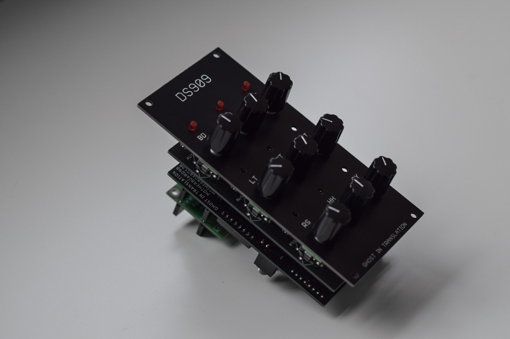
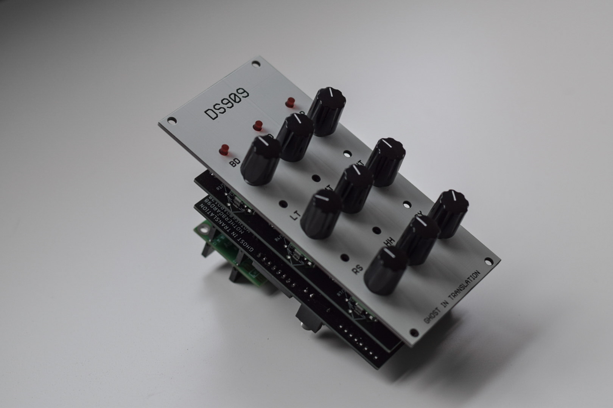

# DS909


DS909 is a 9 voices drum synthesizer, largerly inspired by the TR-909 but not quite a clone, based on eurorack physical format it has however no patch cables in the front but has rather midi and audio jacks in the back.

It is based on [Motherboard9](https://github.com/ghostintranslation/motherboard9), see in there for schematics.

I sell the PCBs and front panel if you wish to build it. <br/>You can get them here: https://ghostintranslation.bandcamp.com/merch/ds909-panel-and-pcb


 

## Features

* 9 voices
* 1 "spiral" control per voice
* Synthesized and sample sounds
* MIDI over USB
* MIDI over mini jack
* Audio jack output

## Dimensions

Height: 3U / 128.5mm

Width: 12HP / 60mm

## Getting Started

### Prerequisites

What things you need to make it work:

```
1 Teensy 4.0
1 Teensy audio board
1 MOTHERBOARD9A pcb
1 MOTHERBOARD9B pcb
1 DS909 front panel pcb
9 vertical linear 10k potentiometers
3 14 pins male header
5 14 pins female header
1 5 pins female headers
6 CD4051 multiplexers
6 DIP16 IC sockets (optional)
2 3.5mm jack connectors
1 4 positions dipswitch (optional)
1 resistor ~ 22ohm *
9 LED
```

* Regarding the resistor, this resistor is for the leds, you might notice that a 1ohm resistor will do the trick too, this is because the multiplexers have actually impedance depending on the switch frequency.

I personally get these parts from multiple stores: digikey.com, thonk.co.uk, modularaddict.com, amazon, aliexpress... See [Motherboard9](https://github.com/ghostintranslation/motherboard9) for more details about parts.

In order to run any sketch on the Teensy you have to install the Teensyduino add-on to Arduino.
Follow the instructions from the official page:
https://www.pjrc.com/teensy/teensyduino.html

Then open the sketch located in the Synth folder of this repo.

In the Tools -> USB Type menu, choose "Serial + midi".

Then you are ready to compile and upload the sketch.

## How to use

Here is a description of the 9 inputs and what they do:

```
BD
    - Synthesized
    - Spiral: Pitch, Click, Decay
    - MIDI note: 36

SN
    - Synthesized
    - Spiral: Pitch, Tone, Decay
    - MIDI note: 40

CP
    - Synthesized
    - Spiral: Tone, Decay
    - MIDI note: 39

LT
    - Synthesized
    - Spiral: Pitch, Decay
    - MIDI note: 45
    
MT
    - Synthesized
    - Spiral: Pitch, Decay
    - MIDI note: 48

HT
    - Synthesized
    - Spiral: Pitch, Decay
    - MIDI note: 50

RM
    - Synthesized
    - Spiral: Pitch, Tone
    - MIDI note: 37

HH
    - Sample
    - Pitch
    - MIDI notes:
        - Closed: 42
        - Open: 46

CY
    - Sample
    - Pitch
    - MIDI notes:
        - Cymbal: 51
        - Crash: 49
```

## MIDI

The MIDI input and output jacks are directly connected to the Teensy serial input and output. That means there is not protection against voltage or current. It is primarily ment to connect 2 of these modules, or 2 Teensy together. If you want to connect something else to it make sure to provide a maximum of 3.3v and 250 mA.

## License

This project is licensed under the MIT License - see the [LICENSE.md](LICENSE.md) file for details

# About me
You can find me on Bandcamp and Instagram:

https://ghostintranslation.bandcamp.com/

https://www.instagram.com/ghostintranslation/

https://www.youtube.com/channel/UCcyUTGTM-hGLIz4194Inxyw

https://www.ghostintranslation.com/